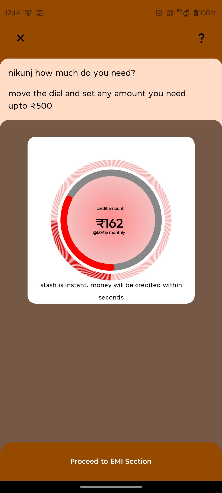
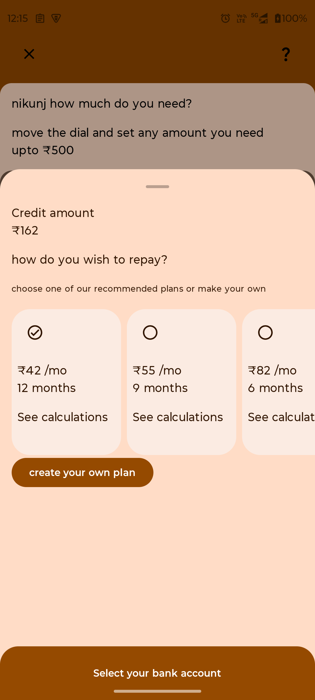
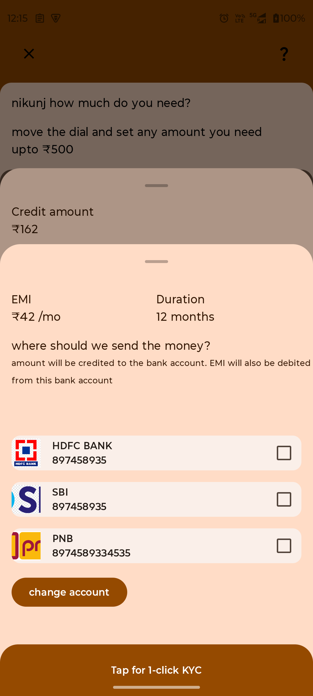

# CRED Assignment

This is an Android application built as part of a coding assignment. The project demonstrates modern **UI** using Kotlin and Jetpack components.

## 🚀 Features
- Built with **Kotlin** and **Jetpack Compose**
- Responsive **Material 3 UI**
- Supports light & dark themes

## 📸 Screenshots
| Home Screen | Details Screen |
|-------------|----------------|
|  |  | 


## 🎥 Demo Video
You can watch the demo of the application here:  
[


## 🛠️ Tech Stack
- **Kotlin**
- **Jetpack Compose**
- **Canvas**
- **Coroutines (asynchronous programming)**

## ⚙️ Setup & Installation
1. Clone the repository:
   ```bash
   git clone https://github.com/your-username/CRED_Assignment.git

⭐ If you like this project, don’t forget to star the repo!
